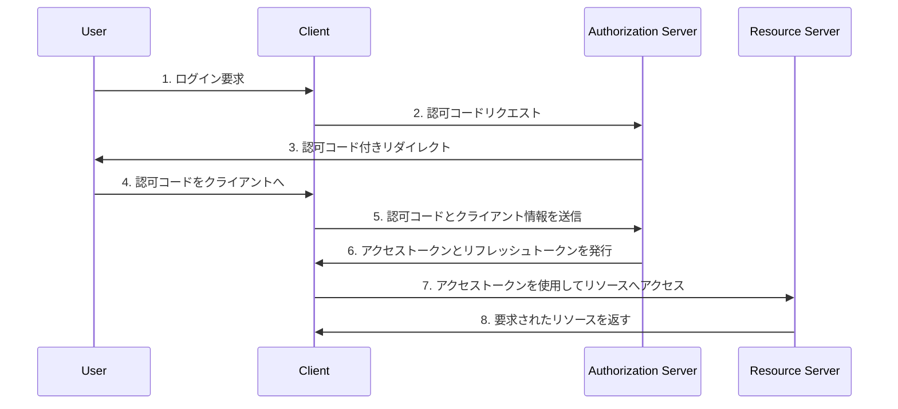

1. Fortifyのインストールと設定：
   ```
   composer require laravel/fortify
   php artisan fortify:install
   ```

2. Bootstrapのインストール：
   ```
   composer require laravel/ui --dev
   php artisan ui bootstrap
   npm install && npm run build
   ```

6. レイアウトファイル（`resources/views/layouts/app.blade.php`）の作成：

```html
<!DOCTYPE html>
<html lang="ja">
<head>
    <meta charset="UTF-8">
    <meta name="viewport" content="width=device-width, initial-scale=1.0">
    <title>@yield('title', 'My App')</title>
    @vite(['resources/sass/app.scss', 'resources/js/app.js'])
</head>
<body>
    <nav class="navbar navbar-expand-lg navbar-light bg-light">
        <div class="container">
            <a class="navbar-brand" href="/">My App</a>
            <button class="navbar-toggler" type="button" data-bs-toggle="collapse" data-bs-target="#navbarNav" aria-controls="navbarNav" aria-expanded="false" aria-label="Toggle navigation">
                <span class="navbar-toggler-icon"></span>
            </button>
            <div class="collapse navbar-collapse" id="navbarNav">
                <ul class="navbar-nav ms-auto">
                    @guest
                        <li class="nav-item">
                            <a class="nav-link" href="{{ route('login') }}">ログイン</a>
                        </li>
                        <li class="nav-item">
                            <a class="nav-link" href="{{ route('register') }}">登録</a>
                        </li>
                    @else
                        <li class="nav-item dropdown">
                            <a class="nav-link dropdown-toggle" href="#" id="navbarDropdown" role="button" data-bs-toggle="dropdown" aria-expanded="false">
                                {{ Auth::user()->name }}
                            </a>
                            <ul class="dropdown-menu" aria-labelledby="navbarDropdown">
                                <li><a class="dropdown-item" href="{{ route('home') }}">ホーム</a></li>
                                <li><hr class="dropdown-divider"></li>
                                <li>
                                    <form method="POST" action="{{ route('logout') }}">
                                        @csrf
                                        <button type="submit" class="dropdown-item">ログアウト</button>
                                    </form>
                                </li>
                            </ul>
                        </li>
                    @endguest
                </ul>
            </div>
        </div>
    </nav>

    <main class="container mt-4">
        @yield('content')
    </main>
</body>
</html>

```

7. ホームビューの作成

ホームビュー（`resources/views/home.blade.php`）

```html
@extends('layouts.app')

@section('title', 'ホーム')

@section('content')
<div class="container">
    <div class="row justify-content-center">
        <div class="col-md-8">
            <div class="card">
                <div class="card-header">ダッシュボード</div>

                <div class="card-body">
                    @if (session('status'))
                        <div class="alert alert-success" role="alert">
                            {{ session('status') }}
                        </div>
                    @endif

                    ログインしました！
                </div>
            </div>
        </div>
    </div>
</div>
@endsection
```
コントローラ作成
```
 php artisan make:controller HomeController
```
```

 public function index()
 {
    return view('home');
 }
```

routes/web.php
```
 Route::get('/home', [HomeController::class, 'index'])->middleware(['auth'])->name('home');
```

7. 認証ビューの作成：

ログインビュー（`resources/views/auth/login.blade.php`）：

```html
@extends('layouts.app')

@section('title', 'ログイン')

@section('content')
<div class="row justify-content-center">
    <div class="col-md-6">
        <div class="card">
            <div class="card-header">ログイン</div>
            <div class="card-body">
                <form method="POST" action="{{ route('login') }}">
                    @csrf
                    <div class="mb-3">
                        <label for="email" class="form-label">メールアドレス</label>
                        <input type="email" class="form-control" id="email" name="email" required autofocus>
                    </div>
                    <div class="mb-3">
                        <label for="password" class="form-label">パスワード</label>
                        <input type="password" class="form-control" id="password" name="password" required>
                    </div>
                    <div class="mb-3 form-check">
                        <input type="checkbox" class="form-check-input" id="remember" name="remember">
                        <label class="form-check-label" for="remember">ログイン状態を保持する</label>
                    </div>
                    <button type="submit" class="btn btn-primary">ログイン</button>
                </form>
                <div class="mt-3">
                    <a href="{{ route('password.request') }}">パスワードをお忘れですか？</a>
                </div>
            </div>
        </div>
    </div>
</div>
@endsection

```

登録ビュー（`resources/views/auth/register.blade.php`）：

```html
@extends('layouts.app')

@section('title', '新規登録')

@section('content')
<div class="row justify-content-center">
    <div class="col-md-6">
        <div class="card">
            <div class="card-header">新規登録</div>
            <div class="card-body">
                <form method="POST" action="{{ route('register') }}">
                    @csrf
                    <div class="mb-3">
                        <label for="name" class="form-label">名前</label>
                        <input type="text" class="form-control" id="name" name="name" required autofocus>
                    </div>
                    <div class="mb-3">
                        <label for="email" class="form-label">メールアドレス</label>
                        <input type="email" class="form-control" id="email" name="email" required>
                    </div>
                    <div class="mb-3">
                        <label for="password" class="form-label">パスワード</label>
                        <input type="password" class="form-control" id="password" name="password" required>
                    </div>
                    <div class="mb-3">
                        <label for="password_confirmation" class="form-label">パスワード（確認）</label>
                        <input type="password" class="form-control" id="password_confirmation" name="password_confirmation" required>
                    </div>
                    <button type="submit" class="btn btn-primary">登録</button>
                </form>
            </div>
        </div>
    </div>
</div>
@endsection

```

パスワードリセットビュー（`resources/views/auth/forgot-password.blade.php`）：

```html
@extends('layouts.app')

@section('title', 'パスワードリセット')

@section('content')
<div class="row justify-content-center">
    <div class="col-md-6">
        <div class="card">
            <div class="card-header">パスワードリセット</div>
            <div class="card-body">
                <form method="POST" action="{{ route('password.email') }}">
                    @csrf
                    <div class="mb-3">
                        <label for="email" class="form-label">メールアドレス</label>
                        <input type="email" class="form-control" id="email" name="email" required autofocus>
                    </div>
                    <button type="submit" class="btn btn-primary">パスワードリセットリンクを送信</button>
                </form>
            </div>
        </div>
    </div>
</div>
@endsection

```

2FA確認ビュー（`resources/views/auth/two-factor-challenge.blade.php`）：

```html
@extends('layouts.app')

@section('title', '2段階認証')

@section('content')
<div class="row justify-content-center">
    <div class="col-md-6">
        <div class="card">
            <div class="card-header">2段階認証</div>
            <div class="card-body">
                <form method="POST" action="{{ url('/two-factor-challenge') }}">
                    @csrf
                    <div class="mb-3">
                        <label for="code" class="form-label">認証コード</label>
                        <input type="text" class="form-control" id="code" name="code" required autofocus>
                    </div>
                    <button type="submit" class="btn btn-primary">確認</button>
                </form>

                <hr>

                <form method="POST" action="{{ url('/two-factor-challenge') }}">
                    @csrf
                    <div class="mb-3">
                        <label for="recovery_code" class="form-label">リカバリーコード</label>
                        <input type="text" class="form-control" id="recovery_code" name="recovery_code">
                    </div>
                    <button type="submit" class="btn btn-secondary">リカバリーコードを使用</button>
                </form>
            </div>
        </div>
    </div>
</div>
@endsection

```

メール確認ビュー（`resources/views/auth/verify-email.blade.php`）：

```html
@extends('layouts.app')

@section('title', 'メールアドレスの確認')

@section('content')
<div class="container">
    <div class="row justify-content-center">
        <div class="col-md-8">
            <div class="card">
                <div class="card-header">メールアドレスの確認</div>

                <div class="card-body">
                    @if (session('resent'))
                        <div class="alert alert-success" role="alert">
                            新しい確認リンクがあなたのメールアドレスに送信されました。
                        </div>
                    @endif

                    メールアドレス確認のリンクをお送りしました。
                    メールが届いていない場合は、
                    <form class="d-inline" method="POST" action="{{ route('verification.send') }}">
                        @csrf
                        <button type="submit" class="btn btn-link p-0 m-0 align-baseline">こちらをクリックして再送信してください</button>。
                    </form>
                </div>
            </div>
        </div>
    </div>
</div>
@endsection

```

8. `FortifyServiceProvider`の設定：

```php
<?php

namespace App\Providers;

use App\Actions\Fortify\CreateNewUser;
use App\Actions\Fortify\ResetUserPassword;
use App\Actions\Fortify\UpdateUserPassword;
use App\Actions\Fortify\UpdateUserProfileInformation;
use Illuminate\Cache\RateLimiting\Limit;
use Illuminate\Http\Request;
use Illuminate\Support\Facades\RateLimiter;
use Illuminate\Support\ServiceProvider;
use Laravel\Fortify\Fortify;

class FortifyServiceProvider extends ServiceProvider
{
    public function register(): void
    {
        //
    }

    public function boot(): void
    {
        Fortify::createUsersUsing(CreateNewUser::class);
        Fortify::updateUserProfileInformationUsing(UpdateUserProfileInformation::class);
        Fortify::updateUserPasswordsUsing(UpdateUserPassword::class);
        Fortify::resetUserPasswordsUsing(ResetUserPassword::class);

        Fortify::loginView(function () {
            return view('auth.login');
        });

        Fortify::registerView(function () {
            return view('auth.register');
        });

        Fortify::requestPasswordResetLinkView(function () {
            return view('auth.forgot-password');
        });

        Fortify::resetPasswordView(function ($request) {
            return view('auth.reset-password', ['request' => $request]);
        });

        Fortify::verifyEmailView(function () {
            return view('auth.verify-email');
        });

        Fortify::twoFactorChallengeView(function () {
            return view('auth.two-factor-challenge');
        });

        RateLimiter::for('login', function (Request $request) {
            $throttleKey = Str::transliterate(Str::lower($request->input(Fortify::username())).'|'.$request->ip());
            return Limit::perMinute(5)->by($throttleKey);
        });

        RateLimiter::for('two-factor', function (Request $request) {
            return Limit::perMinute(5)->by($request->session()->get('login.id'));
        });
    }
}

```

9. `config/fortify.php`ファイルの設定：

```php
<?php

use Laravel\Fortify\Features;

return [
    'features' => [
        Features::registration(),
        Features::resetPasswords(),
        Features::emailVerification(),
        Features::updateProfileInformation(),
        Features::updatePasswords(),
        Features::twoFactorAuthentication([
            'confirmPassword' => true,
        ]),
    ],
];

```

10. `app/Models/User.php`の修正：

```php
<?php

namespace App\Models;

use Illuminate\Contracts\Auth\MustVerifyEmail;
use Illuminate\Database\Eloquent\Factories\HasFactory;
use Illuminate\Foundation\Auth\User as Authenticatable;
use Illuminate\Notifications\Notifiable;
use Laravel\Sanctum\HasApiTokens;
use Laravel\Fortify\TwoFactorAuthenticatable;

class User extends Authenticatable implements MustVerifyEmail
{
    use HasApiTokens, HasFactory, Notifiable, TwoFactorAuthenticatable;

    // 既存のコード...
}

```

11. メール送信の設定（`.env`ファイル）：
```
MAIL_MAILER=smtp
MAIL_HOST=smtp.mailtrap.io
MAIL_PORT=


以下に、DBスキーマ構造を確認するためのいくつかの方法を示します：

1. `db:show` コマンドの使用:

このコマンドは、データベース全体の構造を表示します。

```bash
php artisan db:show
```

特定のテーブルの構造を確認したい場合：

```bash
php artisan db:show {table-name}
```

2. `schema:dump` コマンドの使用:

このコマンドは、現在のデータベーススキーマのスナップショットを database/schema/mysql-schema.sql に作成します。

```bash
php artisan schema:dump
```


Here is a simple flow chart:


